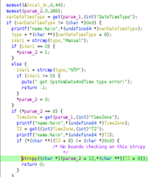
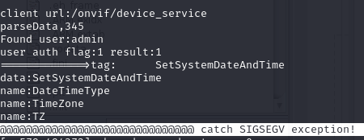

# CVE-2024-51347: Unauthenticated Remote Code Execution in LSC Indoor Camera via ONVIF TimeZone

## Vulnerability Metadata

| Field | Details |
| :--- | :--- |
| **Vendor** | LSC |
| **Product** | Smart Indoor IP Camera |
| **Affected Version** | < V7.6.32 |
| **Component** | `dgiot` binary (ONVIF Service) |
| **Attack Type** | Network / LAN |
| **CWE ID** | CWE-121: Stack-based Buffer Overflow, CWE-120: Buffer Copy without Checking Size |
| **CVSS 3.1 Vector** | `CVSS:3.1/AV:N/AC:L/PR:H/UI:N/S:U/C:H/I:H/A:H` |
| **Base Score** | 7.2 (High) |
| **Impact** | Code Execution, Denial of Service |

---

## Executive Summary
A critical stack-based buffer overflow vulnerability was identified in the `dgiot` binary of the LSC Indoor Camera. The flaw exists in the handling of the Time Zone (`TZ`) parameter within the ONVIF configuration interface. By sending an oversized string to the Time Settings endpoint, an attacker can overwrite the Return Instruction Pointer (RIP) to achieve arbitrary command execution. Combined with hardcoded ONVIF credentials, this allows for full remote system compromise.

---

## Vulnerability Analysis: Stack-based Buffer Overflow
The vulnerability is located in the "Time Settings" module of the ONVIF interface.

### Root Cause
When a user updates the Time Zone (TZ), the input string is processed by the `dgiot` binary. The application utilizes the insecure `strcpy()` function to move the user-supplied TZ string into a fixed-length stack buffer without performing bounds checking.

### Exploitability & Binary Protections
Using `checksec` on the `dgiot` binary reveals a lack of modern exploit mitigations:
* **NX (No-Execute):** Disabled.
* **Stack Canary:** Disabled.
* **ASLR:** Enabled.
* **RELRO:** Partial RELRO.

Because the stack is executable and canaries are absent, the buffer overflow is directly exploitable for code injection, despite ASLR being enabled (via ROP or shellcode injection if the stack address can be leaked/predicted).

---

## Proof of Concept (PoC)

### 1. Segmentation Fault / Denial of Service
Sending a crafted ONVIF request to set the `TZ` parameter with a string length exceeding 267 characters results in a corruption of the Return Instruction Pointer (RIP).

**Example Payload:**
A string of 268 'A's sent to the server triggers a segmentation fault, leading to a service crash and immediate device reboot.

### 2. Remote Code Execution (RCE)
By overwriting the RIP with the address of a malicious payload or a series of gadgets, an attacker can execute arbitrary system commands. 

---

## Impact
This vulnerability poses a severe risk to user privacy and device security:
1. **Full System Takeover:** Attackers gain `root` access via RCE.
2. **Privacy Violation:** Unauthenticated access to the live video and audio feed.

---

## Recommendation
* **Replace Insecure Functions:** Replace all instances of `strcpy()` and `strcat()` with safer alternatives like `strncpy()` and `strncat()`.
* **Input Validation:** Implement strict length validation for all parameters received via the ONVIF interface (Time Zone, Protocol, etc.).
* **Enable Mitigations:** Recompile the firmware with **NX** (Non-Executable Stack) and **Stack Canaries** enabled.
* **Credential Security:** Remove hardcoded credentials and require users to set a unique password during initial setup.
