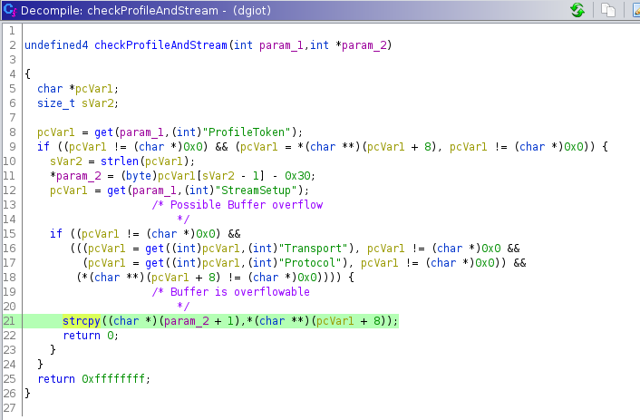
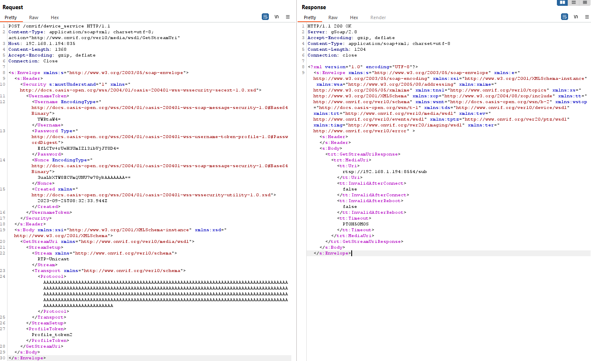

# CVE-2025-69986: Stack-based Buffer Overflow in ONVIF GetStreamUri via Protocol Parameter

## Vulnerability Metadata

| Field | Details |
| :--- | :--- |
| **Vendor** | LSC |
| **Product** | Smart Indoor IP Camera |
| **Affected Version** | < V7.6.32 |
| **Component** | `dgiot` binary (ONVIF Service - GetStreamUri) |
| **Attack Type** | Network / LAN |
| **CWE ID** | CWE-121: Stack-based Buffer Overflow, CWE-20: Improper Input Validation |
| **CVSS 3.1 Vector** | `CVSS:3.1/AV:N/AC:L/PR:H/UI:N/S:U/C:H/I:H/A:H` |
| **Base Score** | 7.2 (High) |
| **Impact** | Remote Code Execution, Denial of Service |

---

## 1. Executive Summary
A stack-based buffer overflow vulnerability was identified in the `GetStreamUri` implementation of the LSC Indoor Camera's ONVIF service. The vulnerability exists in the processing of the `Protocol` parameter within the `Transport` element of a SOAP request. By providing an oversized string to this parameter, an authenticated attacker (using hardcoded or discovered credentials) can overflow the stack buffer to overwrite the Return Instruction Pointer (RIP), leading to a system crash or arbitrary code execution.

---

## 2. Technical Analysis

### 2.1 Vulnerable Component
The vulnerability resides in the `dgiot` binary, which handles ONVIF requests. Specifically, the handler for the `GetStreamUri` method is affected.

### 2.2 Root Cause
During the parsing of the `StreamSetup -> Transport -> Protocol` XML tag, the application extracts the user-supplied string and copies it into a fixed-size buffer on the stack. This operation is performed using the insecure `strcpy()` function without prior validation of the input string's length.

### 2.3 Binary Protections (Checksec)
The `dgiot` binary lacks modern memory protections, significantly increasing the reliability of an exploit:
* **NX (No-Execute):** **Disabled**. The stack is executable, allowing for direct shellcode execution.
* **Stack Canary:** **Disabled**. There are no stack cookies to detect or prevent buffer overflows.
* **ASLR:** **Enabled**. While Address Space Layout Randomization is present, the lack of NX and Canaries allows for exploitation via stack-address prediction or ROP.

---

## 3. Proof of Concept (PoC)

### 3.1 Denial of Service (Crash)
An attacker can trigger a segmentation fault by sending a specially crafted SOAP request where the `<tt:Protocol>` value exceeds the allocated buffer size.

**Crashing Request Example:**

Upon receiving this request, the dgiot service attempts to copy the long string of 'A's into the stack buffer, overwriting the saved RIP. This results in an immediate SIGSEGV and a subsequent reboot of the camera.

## 4. Impact
-   **Remote Code Execution (RCE)**: Because the stack is executable (NX Disabled), an attacker can place shellcode within the overflow buffer and redirect the RIP to the stack address, granting full root access to the camera's operating system.
-   **Denial of Service (DoS)**: Repeated exploitation can prevent the camera from maintaining a stable state, effectively disabling the security monitoring functionality.

## 5. Recommendations
- **Implement Bounds Checking**: Replace the use of strcpy() with safer alternatives such as strncpy() or strlcpy(), ensuring the input length never exceeds the destination buffer size.
-   **Enable Modern Compiler Protections**: Recompile the dgiot binary with the modern compiler protections such as stack canaries, NX bit, PIE, ...
- **Input Validation**: Enforce a strict schema for ONVIF parameters, rejecting any input that does not conform to expected lengths or character sets.

## Related Vulnerabilities
This vulnerability is part of a broader security assessment of the LSC Indoor Camera. 
It shares a similar root cause with **CVE-2024-51347** (Timezone Parameter Overflow). 
Both flaws stem from the lack of bounds checking in the `dgiot` binary's ONVIF handler.